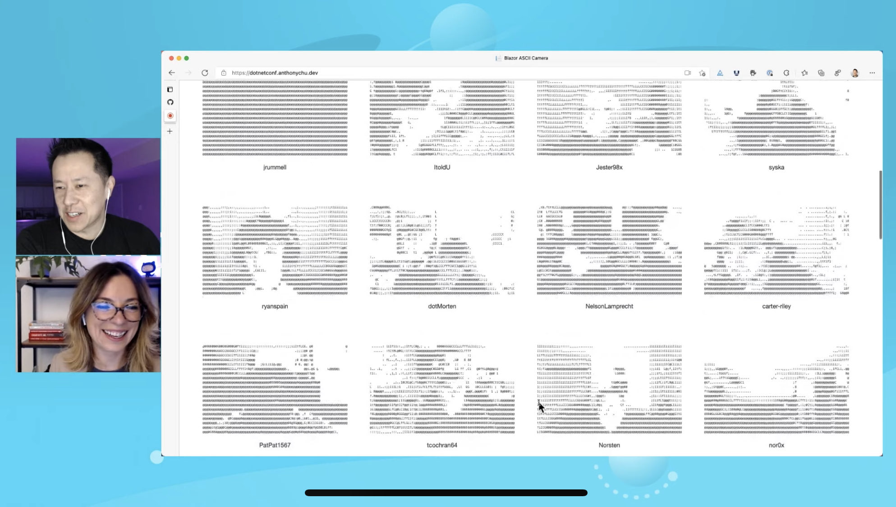

# Blazor ASCII camera streaming

Demo from the [Full-stack .NET with Blazor WebAssembly and Azure Static Web Apps](https://youtu.be/RZhEScjKVHE) session with [Simona Cotin](https://github.com/simonaco) and [Anthony Chu](https://github.com/anthonychu) at .NET Conf 2021.



Based on [Blazor Serverless StreamR](https://github.com/anthonychu/serverless-streamr-blazor) that used SignalR, which was in turn ported from the Vue.js based [Serverless StreamR](https://github.com/anthonychu/serverless-streamr) app.

All of this was inspired by the original [StreamR sample](https://github.com/SignalR/sample-StreamR) from the ASP.NET team.

## Getting started

### Create an Azure Web PubSub instance (free)

1. Go to the [Azure portal](https://portal.azure.com) and sign in.

1. Search for and create a free Azure Web PubSub instance.

1. Go to the Key's page in your new Azure Web PubSub instance and find the primary connection string. You'll need this later.

### Run the app locally

1. Install prerequisites:

    - Install [.NET 6 SDK](https://dotnet.microsoft.com/download/dotnet/6.0) - this allows you to build the Blazor WebAssembly app and the .NET 6 Azure Functions app.

    - Install [Azure Functions Core Tools version 4](https://docs.microsoft.com/azure/azure-functions/functions-run-local?tabs=v4%2Cwindows%2Ccsharp%2Cportal%2Cbash%2Ckeda#install-the-azure-functions-core-tools) - this allows you to run the .NET 6 Azure Functions app. If you have npm:
        ```bash
        npm install -g azure-functions-core-tools@4
        ```

    - Install [Azure Static Web Apps CLI](https://www.npmjs.com/package/@azure/static-web-apps-cli) - this allows you to run your Blazor app and Azure Functions app together locally, and provides Static Web Apps capabilities such as authentication. (requires npm)
        ```bash
        npm install -g @azure/static-web-apps-cli
        ```

1. Fork this repo.

1. Clone your fork to your local machine.

    ```bash
    git clone https://github.com/<YOUR_GITHUB_NAME>/swa-streamr-webpubsub.git
    cd swa-streamr-webpubsub
    ```

1. In the `Api` directory, copy the `local.settings.sample.json` file to `local.settings.json`.

1. In `local.settings.json`, replace the value of the `WebPubSubConnectionString` setting with the connection string from your Azure Web PubSub instance.

1. In the root of the repo, run this command:
    ```bash
    swa start http://localhost:5000 --run "dotnet watch run --project ./Client/Client.csproj" --api ./Api
    ```

    This command does the following:
    - Starts the Blazor app in `Client` (`http://localhost:5000` lets the CLI know what port the Blazor dev server is listening on)
    - Starts the Azure Functions app in `Api`
    - Starts the Static Web Apps emulator at `http://localhost:4280`

    > If you are using VS Code, the project also contains VS Code launch settings to automatically start and debug the app.

1. Open a browser and navigate to `http://localhost:4280`. You should see the Blazor WebAssembly app. It calls a function at `http://localhost:4280/api/connection`, this is automatically routed to the Azure Functions app.

1. Click Login. A mock login screen will appear. Fill in a username you'd like to log in as and click Login.

1. You should now be logged in and have the option to start a stream. Open more browser windows to test streaming from multiple clients.

### Run the app in Azure Static Web Apps

1. The repo you cloned already contains a GitHub Actions workflow. This deploys to my Azure Static Web Apps instance, so it's not very useful for you. Delete it.
    ```bash
    rm -rf .github/workflows
    ```

1. Push your changes to your fork.
    ```bash
    git push
    ```

1. Go to the [Azure Portal](https://portal.azure.com) and search for "Static Web Apps" and click the "Create" button.

1. Fill out the necessary information, such as resource group, name, plan (choose Free), and location.

1. For source control, select "GitHub". Sign in to your GitHub account.

1. Use the dropdowns to find your fork and select it. Select the branch you want to deploy from (`main`).

1. In the list of frameworks, select "Blazor".

1. Confirm that the following values are populated based on your selection:
    - App location: `Client`
    - API location: `Api`
    - Output location: `wwwroot`

1. Create your static web app.

1. Once your app is created, you need to configure the Azure Web PubSub connection string. Navigate to the *Configuration* page of your static web app.

1. Add an application setting called `WebPubSubConnectionString` and set its value to the connection string from your Azure Web PubSub instance.

1. Check the GitHub Actions in your repo to see when your app is finished deploying. When it's done, navigate to your app's URL and you should see the Blazor WebAssembly app.

## Third party libraries

- [camera.js](https://github.com/idevelop/camera.js/) ([License](https://github.com/idevelop/camera.js/blob/master/LICENSE))
- [ascii-camera](https://github.com/idevelop/ascii-camera/) ([License](https://github.com/idevelop/ascii-camera/blob/master/LICENSE))
